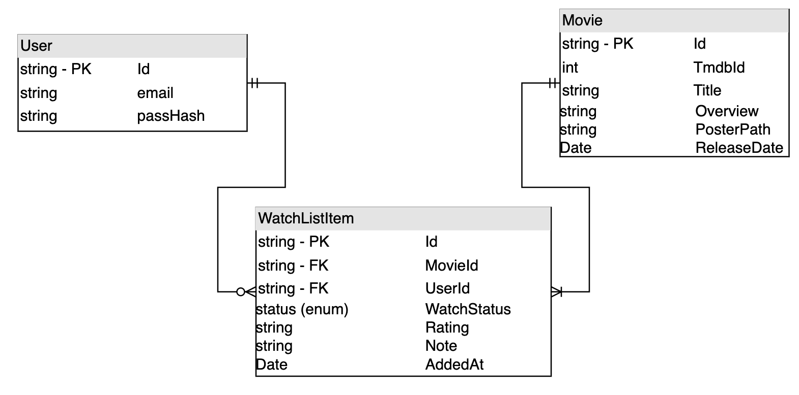

# MovieWatchlist

A .NET 10 web API for tracking a personal movie watchlist. Search films via
[The Movie Database (TMDB)](https://www.themoviedb.org/), add them to a per-user
watchlist, and track their watch status.

---

## Features

- **Movie search & details** pulled from TMDB.
- **Personal watchlist** — add, list (with status filter), update status/rating/note, remove. Every item is scoped to the authenticated user.
- **Authentication** — register, log in for a JWT, log out (which revokes the token).

---

## Architecture

The solution follows the **Clean Architecture** pattern: dependencies point *inward*, so the
domain has no knowledge of the database, the web framework, or TMDB.

| Layer | Responsibility | Key types | Depends on |
|-------|----------------|-----------|------------|
| **Domain** | Entities and rules. Plain C#, zero framework references. | `Movie`, `MovieWatchlistItem`, `WatchStatus` | — |
| **Application** | Use cases and the **ports** (interfaces) the outer layers implement. | `WatchlistService`, `TmdbClient`, `ITmdbClient`, `IMovieRepository`, `IWatchlistRepository`, `ITokenService`, `IRevokedTokenStore`, request/response DTOs | Domain |
| **Infrastructure** | Adapters that **implement** Application ports: EF Core repositories, `AppDbContext` (SQL Server), ASP.NET Core Identity, JWT token service, and DI wiring. | `AppDbContext`, `EfMovieRepository`, `EfWatchlistRepository`, `JwtTokenService`, `InMemoryRevokedTokenStore`, `DependencyInjection` | Application, Domain |
| **Api** | The HTTP delivery layer — minimal-API endpoint groups, mapped from `Program.cs`. | `AuthEndpoints`, `MovieEndpoints`, `WatchlistEndpoints` | Application, Domain |

---

## API Endpoints

Base URL (dev): `http://localhost:5246`. Protected routes require an
`Authorization: Bearer <accessToken>` header obtained from `POST /auth/login`.

### Auth

| Method | Route   | Body | Success | Errors |
|--------|-------|-----|---------|--------|
| `POST` | `/auth/register` | `{ email, password }` | `200` | `400` weak password |
| `POST` | `/auth/login` | `{ email, password }` | `200 { accessToken }` | `401` bad credentials |
| `POST` | `/auth/logout` | — | `200` (revokes the token) | `401` |

### Movies

| Method | Route | Success | Errors |
|--------|-------|---------|--------|
| `GET` | `/movies/search?query={q}` | `200` list of movies | `400` empty query |
| `GET` | `/movies/{tmdbId}` | `200` movie | `400` non-integer id · `404` not found |

### Watchlist

All routes are user-scoped via the JWT's `NameIdentifier` claim.

| Method | Route   | Body | Success | Errors |
|--------|-------|-----|--------|--------|
| `GET` | `/watchlist?status={status}` | — | `200` list | `401` |
| `GET` | `/watchlist/{id}`| — | `200` item | `401` · `404` not found / not owned |
| `POST` | `/watchlist`| `{ tmbdId, status }` | `201` created item | `400` invalid id/status · `401` · `409` already in list |
| `PUT` | `/watchlist/{id}` | `{ watchStatus, rating, note }` | `204` | `400` bad rating/status · `401` · `404` not owned |
| `DELETE` | `/watchlist/{id}` | — | `204` | `401` |

`WatchStatus` is an enum sent as a number: `0` = WantToWatch, `1` = Watching, `2` = Finished.

---

## Getting started

### Prerequisites
- .NET 10 SDK
- Docker (for the SQL Server container)
- A TMDB API key

### 1. Start SQL Server

```bash
cp .env.example .env        # set MSSQL_SA_PASSWORD
docker compose up -d
```

### 2. Configure secrets

Secrets are never committed. Set them via .NET user secrets:

```bash
cd MovieWatchlist
dotnet user-secrets set "ConnectionStrings:DefaultConnection" "Server=localhost,1433;Database=MovieWatchlist;User Id=sa;Password=<your .env password>;TrustServerCertificate=True;"
dotnet user-secrets set "JWTSettings:Key" "<a key of at least 32 bytes>"
dotnet user-secrets set "Tmdb:ApiKey" "<your TMDB v4 token>"
```

### 3. Run

```bash
dotnet run --project MovieWatchlist
```

The app applies EF Core migrations on startup, then listens on `http://localhost:5246`.

---

## Tests

```bash
dotnet test
```

Integration tests spin up the app in-memory (`WebApplicationFactory`) with the database swapped
to the EF Core in-memory provider and TMDB stubbed, so they need neither Docker or a network.

---

## Database Diagram


